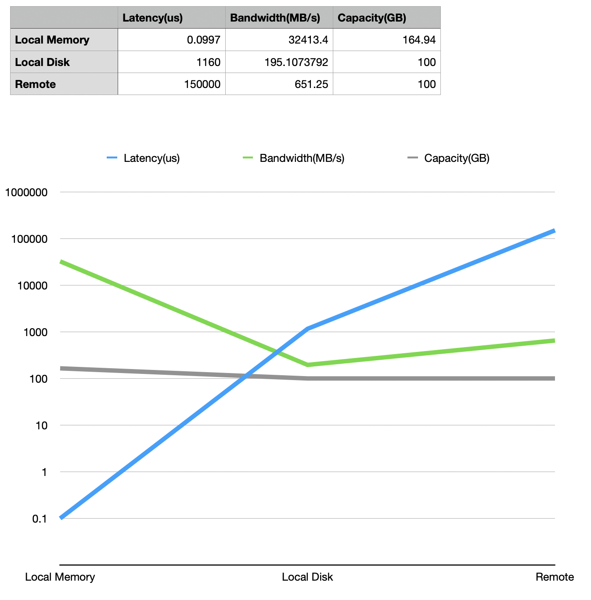

# Part 2

Όπως αναμένται latency και bandwidth αυξάνονται προχωρόντας από τοπική μνήμη σε μόνιμη μνήμη και τέλος σε remote μνήμη. Η μέτρηση της χωρητικότητας του δίσκου έγινε με το du καθώς το hdparm παρουσίαζε πρόβλημα οπότε δεν είμαι σίγουρος για τις μετρήσεις του δίσκου. Θα περίμενα η χωρητικότητα του δίσκου να είναι σημαντικά μεγαλύτερη από την μνήμη.